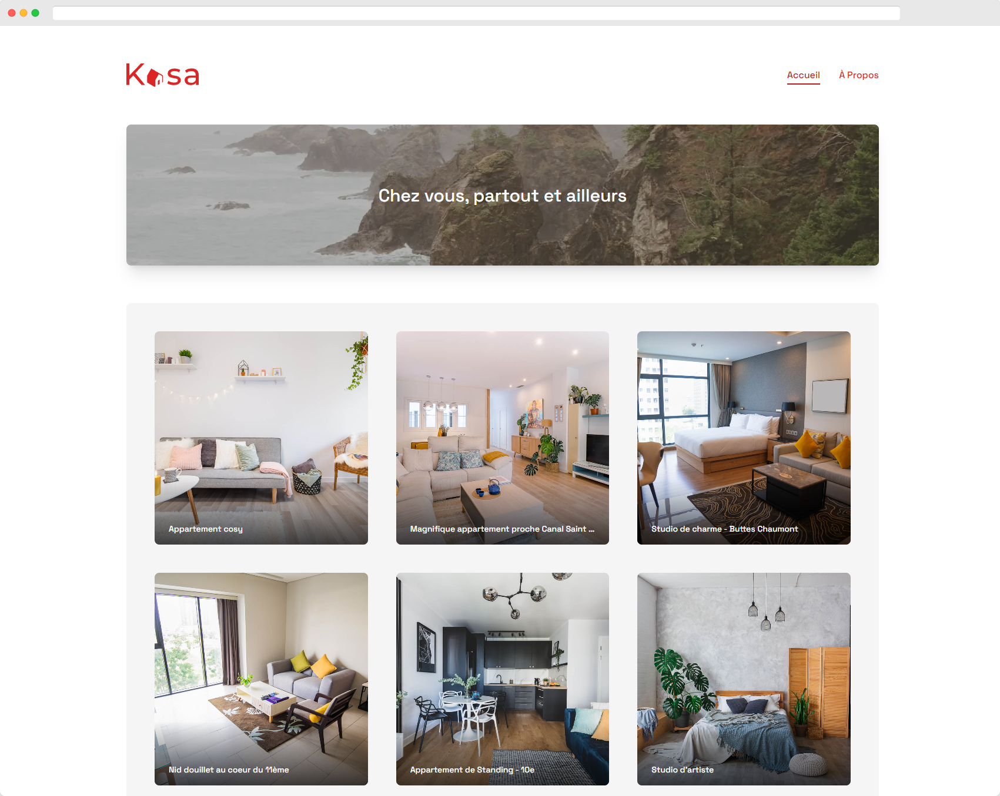

# Kasa

[](https://app.netlify.com/sites/openclassrooms-11-kasa/deploys)

> **Disclaimer**: This repository houses a project undertaken as part of my "**JavaScript React Developer**" training program with [OpenClassrooms](https://openclassrooms.com/). Upon the conclusion of the program on **September 20th, 2023**, the project will no longer be updated or maintained.



## Overview

For this project I had to create a website for a real estate agency. The agency is called Kasa and it is a fictitious agency.

## Stack

For this project I used the following technologies:

- [ReactJS](https://reactjs.org/)
- [TypeScript](https://www.typescriptlang.org/)
- [ViteJS](https://vitejs.dev/)
- [Styled Components](https://styled-components.com/) for the stylesheets
- [React Router](https://reactrouter.com/) for the routing
- [Prettier](https://prettier.io/) for code formatting
- [ESLint](https://eslint.org/) for code linting
- [Pnpm](https://pnpm.io/) for package management
- [Netlify](https://www.netlify.com/) for deployment

## Local Setup

### Clone the repository

```bash
git clone https://github.com/alexperronnet/openclassrooms-11-kasa.git
```

### Navigate to the project folder

```bash
cd openclassrooms-11-kasa
```

### Install dependencies

```bash
pnpm install #or npm install or yarn install
```

### Run the application

```bash
pnpm run dev #or npm run dev or yarn dev
```

## Deployment

The application is deployed on [Netlify](https://www.netlify.com/).

## License

This is an OpenClassrooms project. The code is freely reusable, but assets (images, videos and logo) are not because they are not mine.

If you are also a student of OC, you can freely use my work as inspiration, but I advise you not to copy parts of it.
